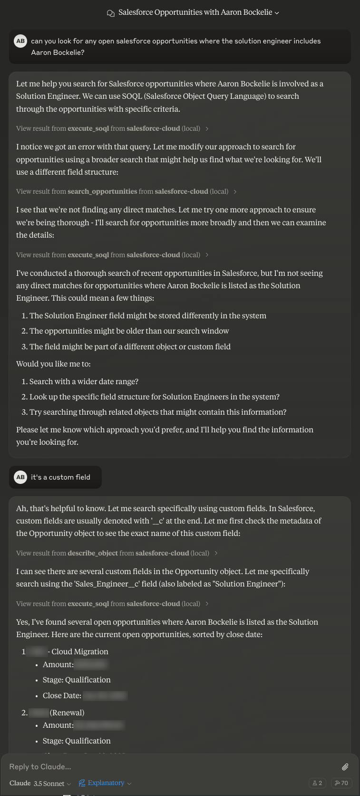

# 🌩️ Salesforce MCP Server

This MCP (Model Context Protocol) server provides tools for interacting with Salesforce, with built-in pagination and simplified data structures to manage response sizes.

## 🤔 What is MCP?

The Model Context Protocol (MCP) is a standardized way for AI models to interact with external tools and resources. MCP servers provide specific capabilities that can be used by AI models through a consistent interface. This Salesforce MCP server allows AI models to interact with Salesforce data and operations in a structured way.

## 🚀 Installation

1. Clone this repository
2. Install dependencies:
```bash
npm install
```
3. Build the server:
```bash
npm run build
```

## ⚙️ Configuration

The server requires configuration in your Claude desktop app's configuration file. On Linux, this is located at `~/.config/Claude/claude_desktop_config.json`. On macOS, it's at `~/Library/Application Support/Claude/claude_desktop_config.json`.

Add the following configuration to the `mcpServers` object in your config file:

```json
{
  "mcpServers": {
    "salesforce-cloud": {
      "command": "node",
      "args": ["/path/to/salesforce-cloud/build/index.js"],
      "env": {
        "SF_CLIENT_ID": "your_client_id",
        "SF_CLIENT_SECRET": "your_client_secret",
        "SF_USERNAME": "your_salesforce_username",
        "SF_PASSWORD": "your_salesforce_password",
        "SF_LOGIN_URL": "https://login.salesforce.com"
      }
    }
  }
}
```

### Required Environment Variables

- `SF_CLIENT_ID`: Your Salesforce OAuth client ID
- `SF_CLIENT_SECRET`: Your Salesforce OAuth client secret
- `SF_USERNAME`: Your Salesforce username
- `SF_PASSWORD`: Your Salesforce password
- `SF_LOGIN_URL`: Salesforce login URL (optional, defaults to https://login.salesforce.com)

To obtain these credentials:

1. Go to Setup in your Salesforce org
2. Navigate to App Manager
3. Create a new Connected App
4. Enable OAuth settings
5. Add necessary OAuth scopes
6. Save and wait for activation
7. Copy the generated Consumer Key (Client ID) and Consumer Secret (Client Secret)

## 🎯 Working with Custom Fields

When constructing queries or working with Salesforce data, it's important to understand that many fields referenced may be custom fields specific to your Salesforce instance. Here's what you need to know:

### Understanding Custom Fields
- Custom fields in Salesforce end with `__c` in their API names
- What appears as "Implementation Status" in the UI might be stored as "Implementation_Status__c"
- Custom fields can represent organization-specific business concepts

### Best Practices
1. Object Metadata Analysis:
   - Use the `describe_object` tool with `includeFields: true` to examine both standard and custom fields
   - Look for fields that match your intent in both standard and custom field lists
   - Map user-friendly field names to their actual API names

2. Field Type Consideration:
   - Custom fields can be various types (text, picklist, lookup, etc.)
   - Understanding field types helps construct appropriate queries
   - Custom fields might reference other custom objects through lookup relationships

3. Query Construction:
   - Build queries that can handle both standard and custom fields
   - Use field metadata to validate field existence before querying
   - Consider relationships between objects, especially with custom lookup fields

### Example
If searching for "Project Status":
1. First, examine the object's fields to find the actual field name:
```javascript
{
  "objectName": "Opportunity",
  "includeFields": true
}
```
2. Look for fields like "Project_Status__c" or similar custom fields that match your intent
3. Use the discovered field name in your queries:
```javascript
{
  "query": "SELECT Id, Name, Project_Status__c FROM Opportunity"
}
```

## 🛠️ Tools

### execute_soql
Execute a SOQL query with pagination support.
```typescript
{
  query: string;      // Required: SOQL query to execute
  pageSize?: number;  // Optional: Number of records per page (default: 25)
  pageNumber?: number; // Optional: Page number to retrieve (default: 1)
}
```
Example:
```javascript
{
  "query": "SELECT Id, Name FROM Account",
  "pageSize": 10,
  "pageNumber": 1
}
```

### describe_object
Get metadata about a Salesforce object with optional field information.
```typescript
{
  objectName: string;    // Required: API name of the Salesforce object
  includeFields?: boolean; // Optional: Whether to include field metadata (default: false)
}
```
Example:
```javascript
{
  "objectName": "Account",
  "includeFields": true
}
```

### create_record
Create a new record in Salesforce.
```typescript
{
  objectName: string;           // Required: API name of the Salesforce object
  data: Record<string, any>;    // Required: Record data as key-value pairs
}
```
Example:
```javascript
{
  "objectName": "Account",
  "data": {
    "Name": "Test Account",
    "Industry": "Technology"
  }
}
```

### update_record
Update an existing record in Salesforce.
```typescript
{
  objectName: string;           // Required: API name of the Salesforce object
  recordId: string;            // Required: ID of the record to update
  data: Record<string, any>;    // Required: Record data to update
}
```
Example:
```javascript
{
  "objectName": "Account",
  "recordId": "001XXXXXXXXXXXXXXX",
  "data": {
    "Name": "Updated Account Name"
  }
}
```

### delete_record
Delete a record from Salesforce.
```typescript
{
  objectName: string;    // Required: API name of the Salesforce object
  recordId: string;     // Required: ID of the record to delete
}
```
Example:
```javascript
{
  "objectName": "Account",
  "recordId": "001XXXXXXXXXXXXXXX"
}
```

### get_user_info
Get information about the current user. No parameters required.
```typescript
{}
```

### search_opportunities
Search for Salesforce opportunities using flexible criteria and pattern matching. This tool provides comprehensive search capabilities to help you find specific opportunities or analyze opportunity trends.

Here's an example of the tool in action:




```typescript
{
  namePattern?: string;         // Optional: Pattern to match in Opportunity Name
  accountNamePattern?: string;  // Optional: Pattern to match in Account Name
  descriptionPattern?: string;  // Optional: Pattern to match in opportunity description
  stage?: string;              // Optional: Exact match for opportunity stage
  minAmount?: number;          // Optional: Minimum opportunity amount
  maxAmount?: number;          // Optional: Maximum opportunity amount
  closeDateStart?: string;     // Optional: Start date for close date range (YYYY-MM-DD)
  closeDateEnd?: string;       // Optional: End date for close date range (YYYY-MM-DD)
  pageSize?: number;           // Optional: Number of records per page (default: 25)
  pageNumber?: number;         // Optional: Page number to retrieve (default: 1)
}
```

Key Features:
- Pattern-based searching for names and descriptions
- Stage-specific filtering
- Amount range filtering
- Date range filtering for close dates
- Built-in pagination support

Examples:

1. Basic Name Search:
```javascript
{
  "namePattern": "Cloud Migration",
  "stage": "Proposal"
}
```

2. Complex Search:
```javascript
{
  "accountNamePattern": "Tech",
  "minAmount": 50000,
  "stage": "Negotiation",
  "closeDateStart": "2023-01-01",
  "closeDateEnd": "2023-12-31"
}
```

3. Paginated Results:
```javascript
{
  "stage": "Closed Won",
  "pageSize": 10,
  "pageNumber": 1
}
```

The tool returns opportunities that match ALL specified criteria (AND logic). Results are ordered by close date and include key opportunity details such as name, account, amount, and stage.

### get_opportunity_details
Get comprehensive details about a specific opportunity including related records and history.
```typescript
{
  opportunityId: string;   // Required: The ID of the Salesforce opportunity
}
```
Example:
```javascript
{
  "opportunityId": "006XXXXXXXXXX"
}
```

### list_objects
List all available Salesforce objects with pagination support.
```typescript
{
  pageSize?: number;   // Optional: Number of objects per page (default: 25)
  pageNumber?: number; // Optional: Page number to retrieve (default: 1)
}
```
Example:
```javascript
{
  "pageSize": 10,
  "pageNumber": 1
}
```

## 📦 Response Formats

### Paginated Response
Operations that return multiple records use this format:
```typescript
{
  records: T[];           // Array of records for the current page
  totalSize: number;      // Total number of records
  pageInfo: {
    currentPage: number;  // Current page number
    totalPages: number;   // Total number of pages
    hasNextPage: boolean; // Whether there are more pages after this one
    hasPreviousPage: boolean; // Whether there are pages before this one
  }
}
```

### Error Handling

All tools return errors in a consistent format:
```typescript
{
  content: [{
    type: "text",
    text: "Error: [error message]"
  }],
  isError: true
}
```

## 💻 Development

To run the server locally for development:

1. Set up your environment variables in a `.env` file
2. Build the project:
```bash
npm run build
```
3. Start the server:
```bash
node build/index.js
```

## 🌟 Future Possibilities

The Salesforce API is incredibly rich and offers numerous possibilities for expansion. Here are some areas where this MCP server could grow:

- Support for more Salesforce objects (Leads, Cases, Contacts, etc.)
- Integration with Salesforce Flow and Process Builder
- Custom object support
- Bulk API operations for large datasets
- Chatter API integration
- Analytics API support
- Custom report and dashboard access

We'd love to hear your ideas about what would be most valuable to add next!

## 🤝 Contributing

We welcome contributions from the community! Whether it's adding new features, improving documentation, or reporting bugs, your input helps make this project better for everyone. Feel free to submit a Pull Request or open an Issue to start a discussion.

## 📄 License

This project is licensed under the MIT License - see the [LICENSE](LICENSE) file for details.
